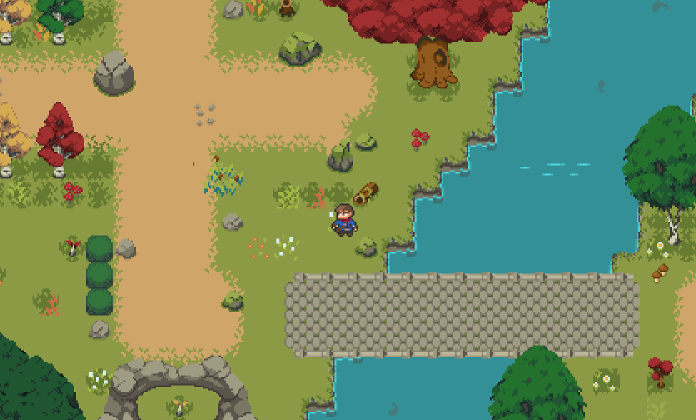

# Z-Battle

## Author

* Jeneiht

## Description
"Z-Battle" is a personal project that revolves around an RPG game. It features a diverse cast of characters and a wide range of monstrous creatures. The game boasts a vibrant and immersive audiovisual experience, with dynamic lighting effects. To ensure scalability and ease of maintenance, the project incorporates various design patterns. Additionally, it leverages algorithms such as Breadth-First Search (BFS) and Local Search to implement efficient pathfinding mechanics.

Developed using the Java programming language and the libGDX library, "Z-Battle" combines the power of Java with the versatility of libGDX to create a robust and engaging gaming experience. The project prioritizes clean and concise code, enabling easy expansion and maintenance in the future.

### Prerequisites

* To run this software, you need an editor with java support, java - version 11 or higher,android-studio
* Install java 11 using the commands:
  `sudo apt update`
  `sudo apt install openjdk-11-jre-headless`


### Setup

* Clone the project


## Technologies Used

* Java (version 11)
* Libgdx
* Gradle


## Demo image


## License Information

* This software is licensed under MIT License.
* [Read More](https://choosealicense.com/licenses/mit/) on the license.


```
MIT License

Copyright (c) 2024 TrongThien

Permission is hereby granted, free of charge, to any person obtaining a copy
of this software and associated documentation files (the "Software"), to deal
in the Software without restriction, including without limitation the rights
to use, copy, modify, merge, publish, distribute, sublicense, and/or sell
copies of the Software, and to permit persons to whom the Software is
furnished to do so, subject to the following conditions:

The above copyright notice and this permission notice shall be included in all
copies or substantial portions of the Software.

THE SOFTWARE IS PROVIDED "AS IS", WITHOUT WARRANTY OF ANY KIND, EXPRESS OR
IMPLIED, INCLUDING BUT NOT LIMITED TO THE WARRANTIES OF MERCHANTABILITY,
FITNESS FOR A PARTICULAR PURPOSE AND NONINFRINGEMENT. IN NO EVENT SHALL THE
AUTHORS OR COPYRIGHT HOLDERS BE LIABLE FOR ANY CLAIM, DAMAGES OR OTHER
LIABILITY, WHETHER IN AN ACTION OF CONTRACT, TORT OR OTHERWISE, ARISING FROM,
OUT OF OR IN CONNECTION WITH THE SOFTWARE OR THE USE OR OTHER DEALINGS IN THE
SOFTWARE.
```
1